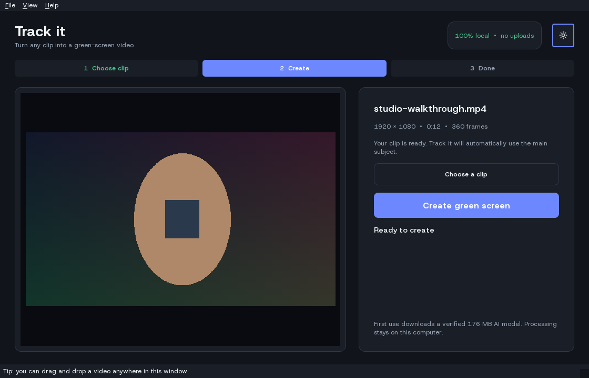

# Track it — turn a clip into a green-screen video

[](https://www.python.org/)
[](LICENSE)

Track it is an open-source desktop app with one simple job: drop in a clip and create an MP4
with the main subject preserved over a bright green background. Subject detection, tracking,
compositing, and audio handling happen locally on your computer.



## Privacy and status

There is no account, cloud inference, upload endpoint, telemetry, analytics SDK, advertising,
or watermark. Pressing **Create green screen** downloads the verified AI model on first use;
the screen discloses the 176 MB download before processing begins.

The simple workflow automatically samples the middle of the clip, chooses a prominent central
subject with SAM 2.1, tracks it in both directions, paints pure green outside the mask, preserves
audio, and saves an H.264 MP4. Work can be cancelled safely, the source clip is never overwritten,
and temporary frames are removed after completion. SAM 2 weights are downloaded separately and
never enter the repository or package.

## Requirements

- Windows 10/11 x64 or Linux x86-64; experimental Apple Silicon MPS
- Python 3.11 (3.12 is supported for source development)
- FFmpeg and ffprobe on `PATH` for source installs; the Windows MSI bundles them
- The MSI uses CPU inference; a source environment with CUDA-enabled PyTorch can use NVIDIA GPUs

## Install and run

### Windows MSI

Download `Track-it-0.1.0-alpha.1-windows-x64.msi`, double-click it, accept the license,
and choose an install folder. Setup installs a Start Menu shortcut and bundles Python,
SAM 2, Qt, and an LGPL FFmpeg build; only the model weights are downloaded on first use.

The alpha MSI is not yet code-signed, so Windows may show an unknown-publisher warning.
See the [Windows installer guide](docs/windows-installer.md) and
[packaging status](docs/packaging-status.md) for verification details and release limitations.

### Source

```powershell
./scripts/bootstrap.ps1
./scripts/run.ps1
```

On Linux:

```bash
./scripts/bootstrap.sh
./scripts/run.sh
```

The CLI supports `python -m track_it diagnostics`, `self-test`, `models list`,
`models download sam2.1-small`, `models verify`, and `project validate PATH`.

## Workflow

Drag a video into the window or choose one, select **Create green screen**, and choose where to
save the result. Track it automatically finds and follows the main subject; there are no masks,
objects, timelines, or tracking controls in the normal workflow. Clips work best when the main
subject is clearly visible near the center around the middle of the video.

See [architecture](docs/architecture.md), [project format](docs/project-format.md),
[model management](docs/model-management.md), [export formats](docs/export-formats.md), and
[troubleshooting](docs/troubleshooting.md).

## Development

```powershell
./scripts/test.ps1
uv run ruff check .
uv run mypy src/track_it
uv run pytest --cov=track_it --cov-report=term-missing
```

Contributions are welcome through issues and pull requests. Report vulnerabilities privately
as described in [SECURITY.md](SECURITY.md). Source is Apache-2.0; models and dependencies retain
their own terms in [MODEL_LICENSES.md](MODEL_LICENSES.md) and [THIRD_PARTY_NOTICES.md](THIRD_PARTY_NOTICES.md).
